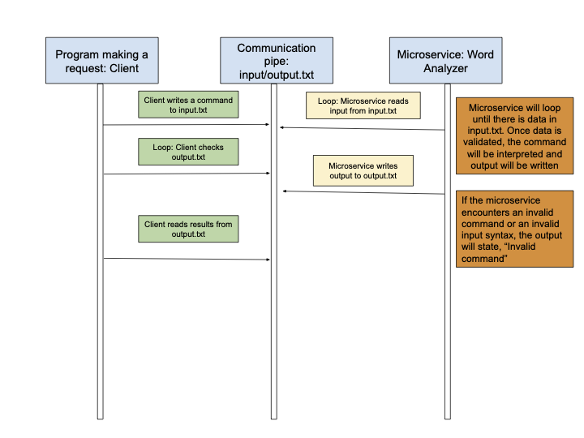

# Word Analyzer Microservice

This README outlines how to **programmatically request and receive data** from Microservice A: Word Analyzer. It defines the input/output behavior and provides a **UML sequence diagram** to illustrate the process.

## Requesting Data from Word Analyzer

To request data, your program must **write a command to `input.txt`**. The command format is:
<operation>,<word>


Where:
- `<operation>` is one of:
  - `length` → Returns the length of the word.
  - `vowels` → Counts the number of vowels in the word.
  - `repeats` → Counts the number of unique repeated characters.
- `<word>` is the word to be processed.

### Example: Sending Requests

```
python
def send_request():
    commands = [
        "length,dog",
        "vowels,cat",
        "repeats,tennis"
    ]

    with open("input.txt", "w") as file:
        for command in commands:
            file.write(command + "\n")

send_request()
print("Requests sent to Word Analyzer")
```

## Receiving Data from Word Analyzer
Word Analyzer processes requests asynchronously and writes the results to output.txt. To receive the results, your program must wait for the processing to complete and then read from output.txt.


### Example: Reading Responses

```
import time

def receive_response():
    time.sleep(6)  # Allow time for processing
    try:
        with open("output.txt", "r") as file:
            results = file.readlines()
            results = [line.strip() for line in results]
            print("Received responses:", results)
            return results
    except FileNotFoundError:
        print("Error: output.txt not found")
        return []

responses = receive_response()
```

## UML Sequence Diagram:




### By following this contract, you can reliably send requests and receive responses from Word Analyzer
